# Pasos para mover un paquete del proyecto a un submódulo

- Crear el repositorio del submódulo. Agregar un readme (el repositorio del submódulo no puede estar vacío al agregarlo al repositorio del proyecto).

- Agregar el submódulo:

git submodule add git@github.com:elagarrigue/AyDS-ASubModuleSpotifyData.git libs/SpotifyData

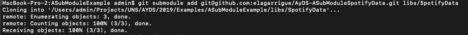

- En el proyecto del android studio, crear un nuevo módulo (android library).

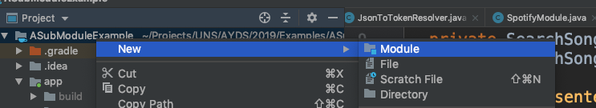
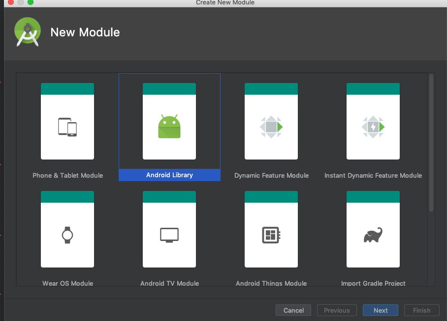
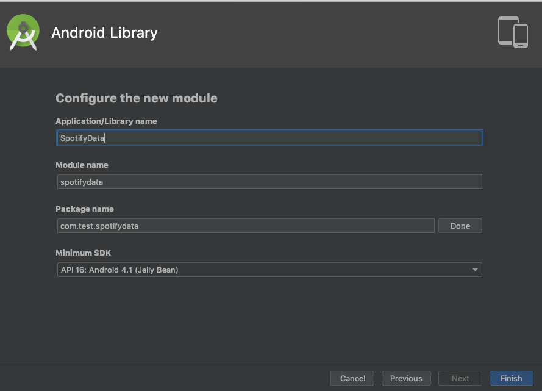

- En este punto tenemos el submódulo vacío en libs, y el módulo nuevo en la raíz del proyecto.

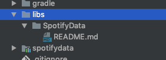

- Mover el contenido del módulo a la carpeta del submódulo.

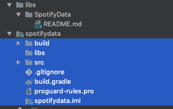
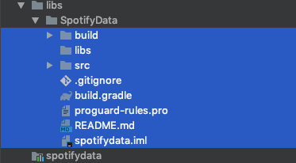

- Modificar settings.gradle para indicar el nuevo path del modulo.

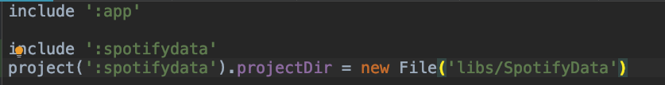

- Al sincronizar, el android studio reconoce el nuevo modulo.

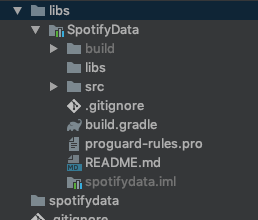

- Actualizar el .gitignore del submodule (copiar el mismo que el del proyecto base). Hacer commit y push del submódulo.

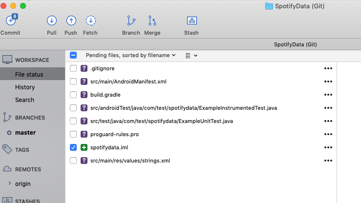
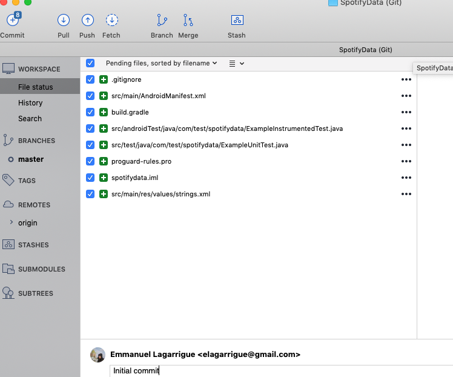

- Hacer commit y push del proyecto.

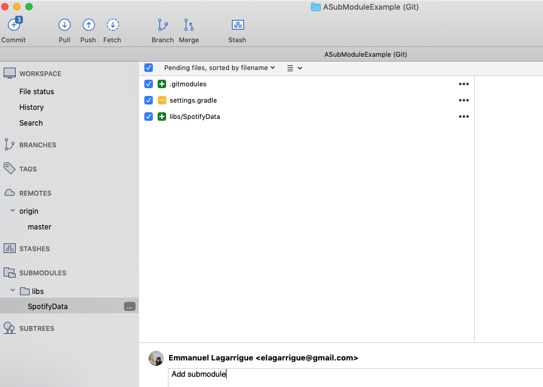

- Crear en el módulo un paquete con nombre relevante.

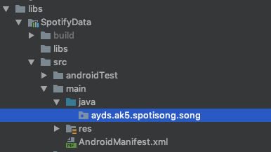

- Mover el paquete “external” de model al módulo.

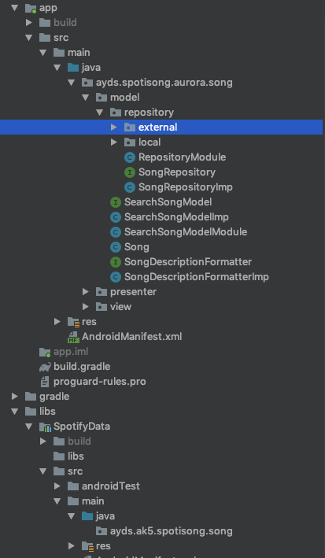
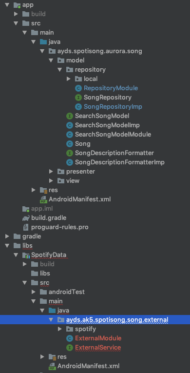

- El nuevo módulo tiene ahora referencias a retrofit. Mover esas dependencias de app/build.gradle a libs/SpotifyData/build.gradle.

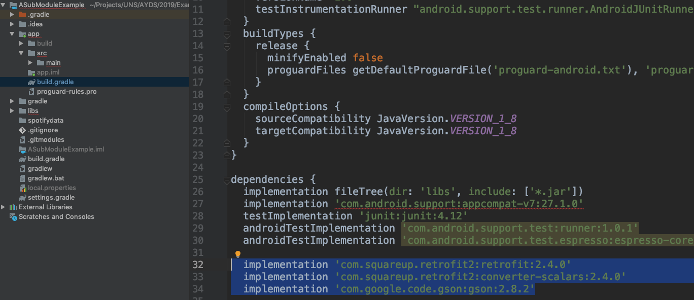
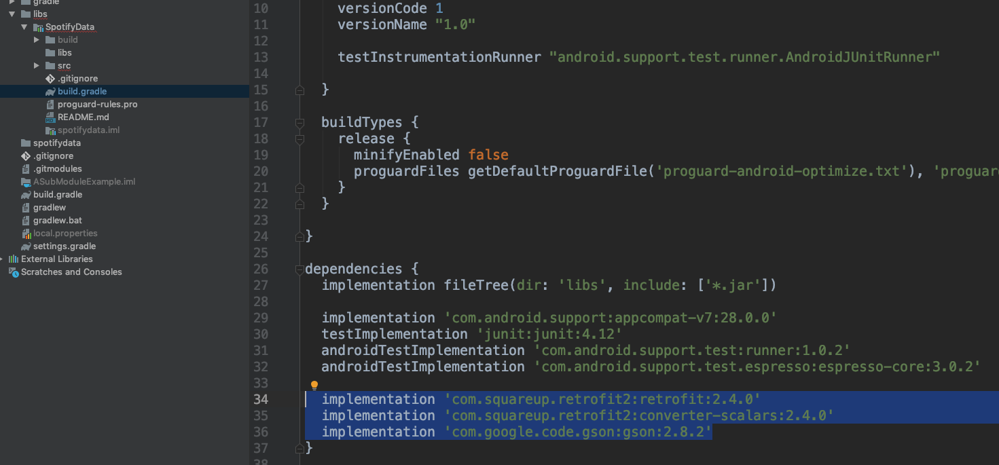

- Ademas, setear la misma config en ambos build.gradle (usar target 28). 

- El proyecto va a dejar de compilar, ya que el código de external no lo tenemos más. Lo primero que hay que hacer es agregar la dependencia del nuevo módulo en el build.gradle de app.

- Al hacer el refactor, el ide debería actualizar los imports. En este caso, solo Repository se ve afectado.

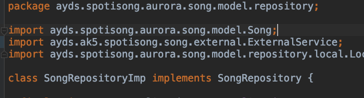

- Si external no era independiente (tenia referencias por fuera del paquete), el modulo no va a compilar. 

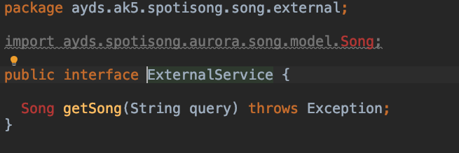

- En este caso, tenemos que implementar nuestra propia clase (una copia de Song), y luego hacer la conversión en Repository.

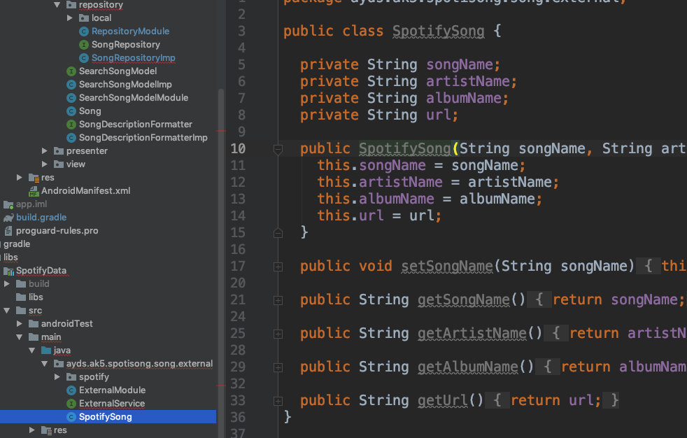
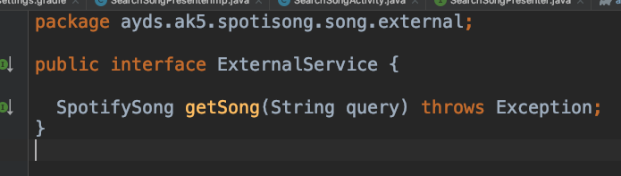
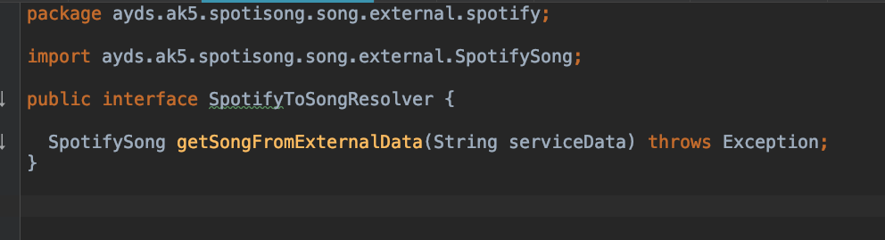
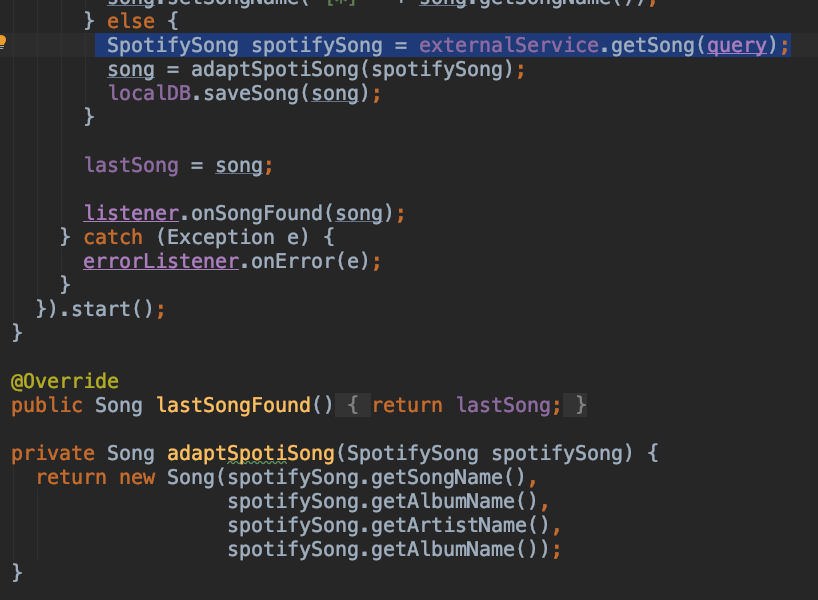

- Hacer Clean, build, run. Una vez que compile y ejecute correctamente hacer commit y push del repo del submódulo, y del proyecto. 

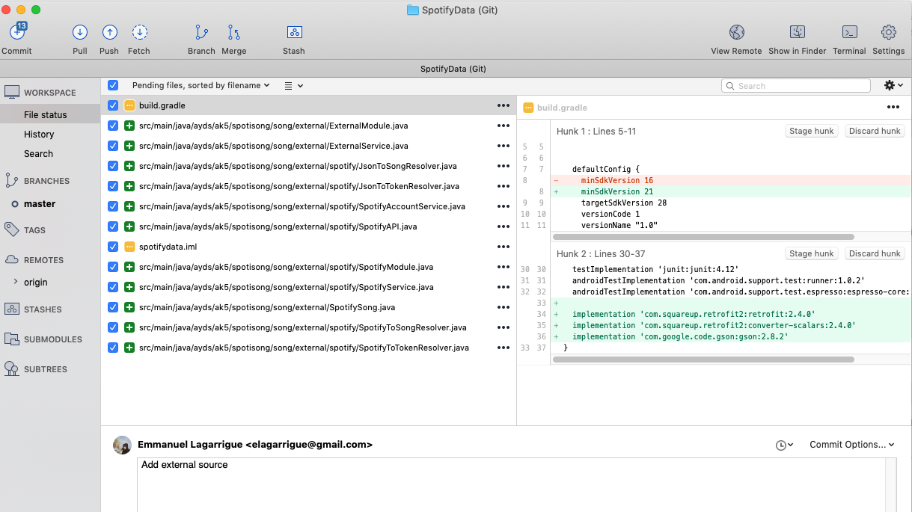
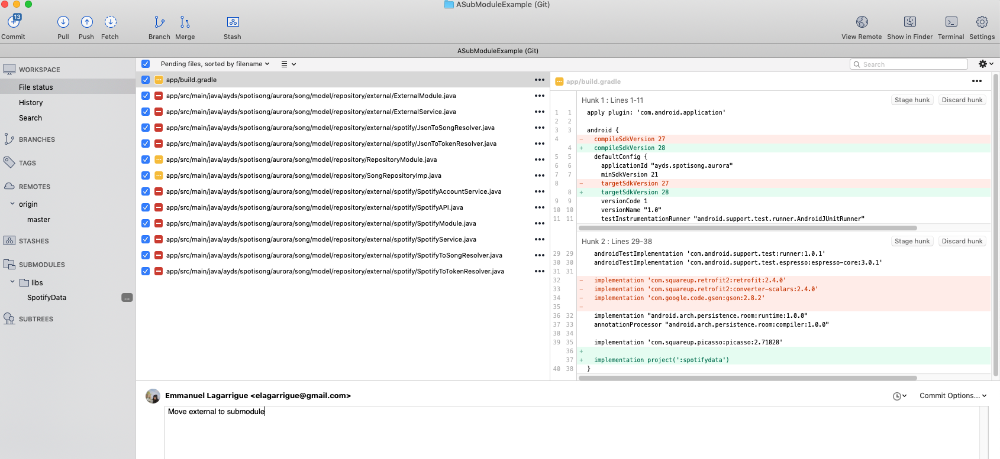